### Hi! 👋 there !
I'm a **Full Stack Engineer with 5+ years of experience** designing and building production-grade applications used by real businesses and users.

I partner with startups, companies, and founders to architect and deliver **scalable applications, SaaS platforms, and high-impact digital products** — from idea to deployment.

I focus on engineering solutions that create measurable business value, not just code.

### What differentiates my work
✔ Production-level architecture decisions  
✔ Scalable system design from day one  
✔ Performance-driven development  
✔ Business-focused engineering strategy  
✔ Long-term maintainable solutions

# 💼 What I Build

### 📱 Application Development (Primary Focus)
• End-to-end application development  
• SaaS platforms and business systems  
• Custom enterprise applications  
• Scalable backend systems  
• Real-time applications  
• API-driven architectures  
• Cloud-native applications

### 🌐 Full Stack Development
• Modern web applications  
• Complex dashboards and platforms  
• Client-facing systems  
• Internal business tools  

### ⚙️ Architecture & Engineering Consulting
• System architecture design  
• Performance optimization  
• Codebase restructuring  
• Scaling strategy  
• Technical decision guidance

### 🛠 &nbsp;Tech Stack

&nbsp;
&nbsp;
&nbsp;
&nbsp;
&nbsp;
&nbsp;
&nbsp;
\
&nbsp;
&nbsp;
&nbsp;
&nbsp;
&nbsp;
&nbsp;
&nbsp;
&nbsp;
&nbsp;

### 📫 &nbsp; How to reach me:

 &nbsp;
 &nbsp;

